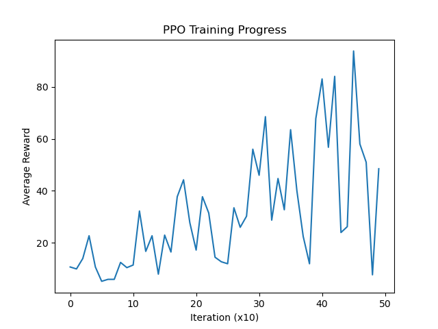

# PPO from Scratch

This project implements Proximal Policy Optimization (PPO) from scratch using PyTorch and OpenAI Gym. It includes training and evaluation scripts along with visualization of the learning progress.

## Features
- Custom implementation of PPO algorithm
- Training environment using OpenAI Gym
- Neural network policy with PyTorch
- Training progress visualization with Matplotlib

## Installation
To set up the project, install the required dependencies:

```sh
pip install -r requirements.txt
```

## Usage

### Training
Run the training script to train a PPO agent:

```sh
python PPO_Scratch.py
```

### Visualization
After training, you can visualize the training progress:

```sh
python PPO_Scratch_test.py
```

## Dependencies
The project requires the following libraries:
- Gym (for environments)
- PyTorch (for deep learning)
- NumPy (for numerical operations)
- Matplotlib (for plotting results)
- tqdm (for progress visualization)

## Training Progress
Below is an example of the training progress plot:



## Author
This project was developed by [Tarık Bulut].

