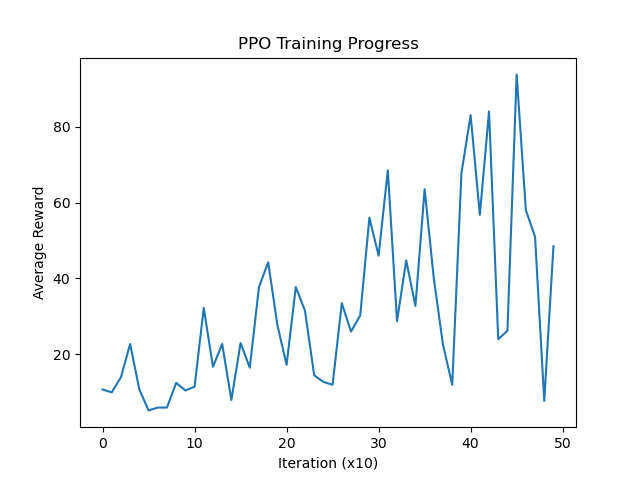
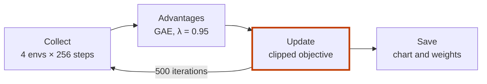

# PPO from Scratch

[](https://www.python.org/)
[](https://pytorch.org/)
[](https://www.gymlibrary.dev/environments/classic_control/cart_pole/)
[](LICENSE)

**Proximal Policy Optimization written by hand in PyTorch, teaching an agent to balance a pole on a cart.**



*Average running reward of the 4 training environments, logged every 10 iterations. Saved by `PPO_Scratch.py`.*

Think of balancing a broom upright on your palm. You watch it tilt and move your hand left or right.
CartPole is that game: each step the agent pushes the cart left or right, and every step the pole stays up earns a point.
The agent starts by pushing at random. PPO turns its good tries into a better policy, a little at a time.
In the saved run the average reward climbs from about 10 to peaks above 80.

- **What it does:** trains a small actor-critic network with PPO on `CartPole-v1`, then plays it back in a window.
- **Why you can follow it:** the whole algorithm is one function. GAE, the clipped objective and the value loss are written out, no RL library.
- **What is included:** the trained weights (`cartpole_ppo_final.pth`) and the training chart, so the demo runs without training.

A self-study project by Tarık Bulut.
Its sibling study: [Linear regression from scratch](https://github.com/Estaed/Linear_Regression_Scratch). The same algorithm, applied to a board game: [Connect4 AI](https://github.com/Estaed/Connet4_AI).

## Quick start

```bash
git clone https://github.com/Estaed/PPO_Scratch.git
cd PPO_Scratch
pip install -r requirements.txt
python PPO_Scratch_test.py
```

`PPO_Scratch_test.py` loads `cartpole_ppo_final.pth` and plays one episode in a window.
It always picks the action the policy rates highest, and prints the total reward at the end.

To train again (this overwrites `ppo_training.png` and `cartpole_ppo_final.pth`):

```bash
python PPO_Scratch.py
```

It uses a CUDA GPU if PyTorch finds one, otherwise the CPU.
A tqdm bar shows the 500 iterations, and the average reward is printed every 10.

The code uses the gym 0.26+ API: `reset()` returns `(obs, info)` and `step()` returns five values.

## How it works


```mermaid
flowchart LR
    A["Collect<br/>4 envs × 256 steps"] --> B["Advantages<br/>GAE, λ = 0.95"]
    B --> C["Update<br/>clipped objective"]
    C -->|"500 iterations"| A
    C --> D["Save<br/>chart and weights"]
    classDef lit stroke:#C23C00,stroke-width:3px
    class C lit
```

1. **Collect.** Four `CartPole-v1` environments run side by side. The current policy samples an action at each step, for 256 steps per environment.
2. **Score the moves.** Generalised Advantage Estimation (γ = 0.99, λ = 0.95) says how much better each action was than the critic expected. Advantages are normalised.
3. **Update.** Three epochs over the batch in minibatches of 256. The policy ratio is clipped to [0.8, 1.2], so one update cannot move the policy too far.
4. **Repeat.** 500 iterations, with the learning rate falling linearly from 3e-4 to 0.
5. **Save.** The reward chart goes to `ppo_training.png` and the weights to `cartpole_ppo_final.pth`.

<details>
<summary><b>Network and hyperparameters</b></summary>

**Network (`ActorCritic`).** A shared body of two 64-unit layers with tanh. On top, an actor head (one logit per action) and a critic head (one value).

| Setting | Value |
|---|---|
| Environment | `CartPole-v1`, wrapped in `RecordEpisodeStatistics` |
| Parallel environments | 4 |
| Steps per environment per iteration (`T`) | 256 |
| Iterations | 500 |
| Epochs per iteration (`K`) | 3 |
| Minibatch size | 256 |
| Discount γ / GAE λ | 0.99 / 0.95 |
| Clip range | 0.2 (ratio in [0.8, 1.2]) |
| Loss | policy loss + 0.5 × value loss − 0.01 × entropy |
| Optimiser | Adam, lr 3e-4, eps 1e-5, linear decay to 0 |
| Gradient clipping | max norm 0.5 |

</details>

<details>
<summary><b>Files in this repository</b></summary>

| Path | What it is |
|---|---|
| `PPO_Scratch.py` | PPO training: environments, actor-critic network, the PPO loop |
| `PPO_Scratch_test.py` | Loads the saved weights and plays one rendered episode |
| `cartpole_ppo_final.pth` | Trained weights from the saved run |
| `ppo_training.png` | Training progress chart from the saved run |
| `requirements.txt` | gym, torch, numpy, matplotlib, tqdm |

</details>

## Licence

[MIT](LICENSE).
